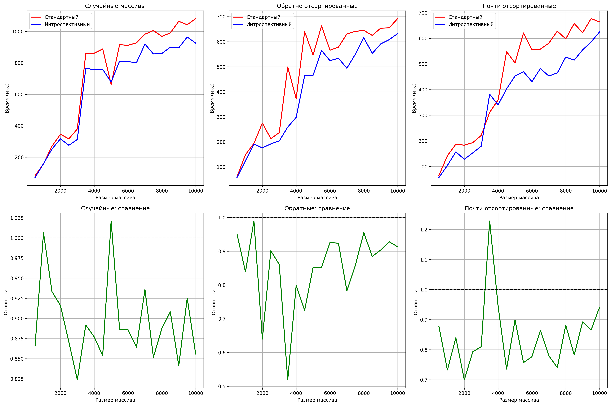

# Сравнение QuickSort и IntroSort

### Описание
Сравнение QuickSort и IntroSort на различных типах массивов.

### Алгоритмы
- QuickSort - классическая реализация со случайным выбором опорного элемента
- IntroSort = QuickSort + HeapSort + InsertionSort

### Графики

### Выводы

Из графиков видно:

1) Случайные массивы:
На случайных данных оба алгоритма работают хорошо, так как QuickSort эффективен при случайном распределении. IntroSort добавляет небольшие накладные расходы на проверки, но выигрывает за счет InsertionSort на малых подмассивах. IntroSort быстрее на малых и больших размерах, в среднем диапазоне оба алгоритма работают примерно одинаково.

2) Обратно отсортированные массивы:
IntroSort превосходит над QuickSort. Время работы классического алгоритма резко возрастает при увеличении размера массива, у IntroSort же сохраняется относительно плавный рост => IntroSort обрабатывает сложные случаи лучше QuickSort.

3) Почти отсортированные массивы:
InsertionSort в IntroSort хорошо работает на почти упорядоченных данных, но иногда случайный выбор опоры в QuickSort дает лучший баланс разделения.

IntroSort превосходит на сложных случаях и дает сравнимую производительность на обычных данных.

### ID посылки в системе CodeForces: 348776505
